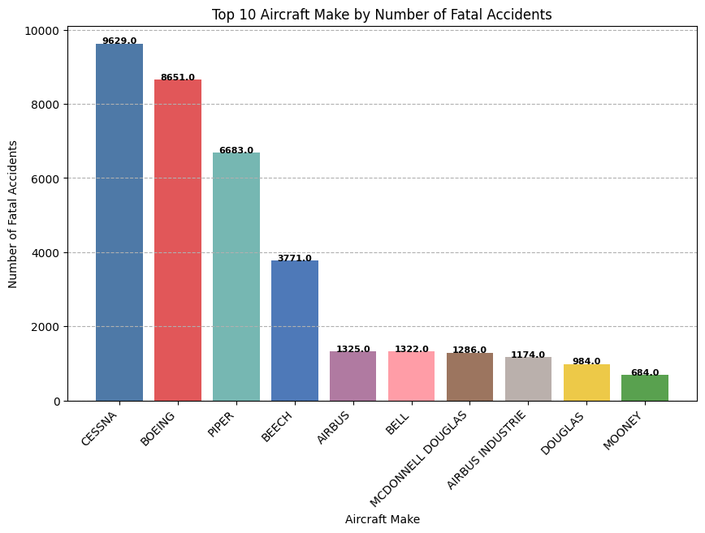
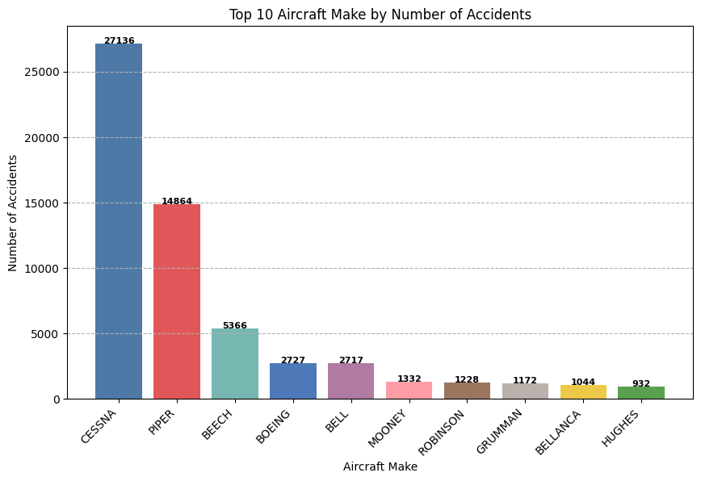
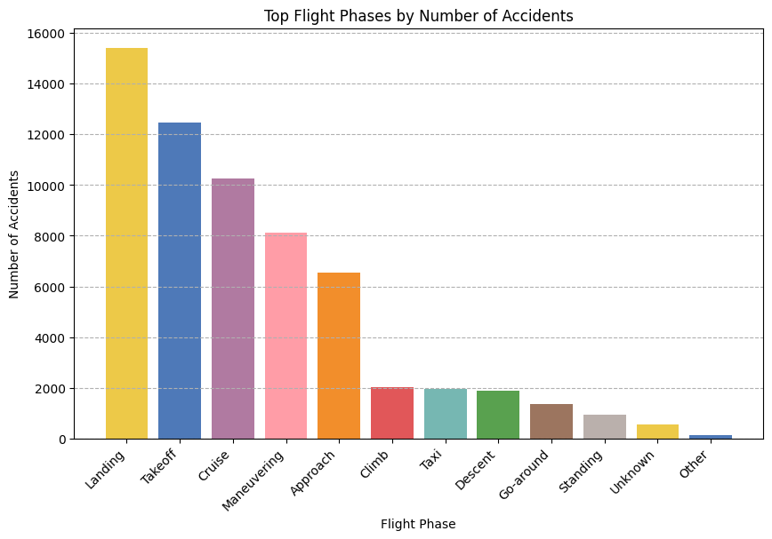
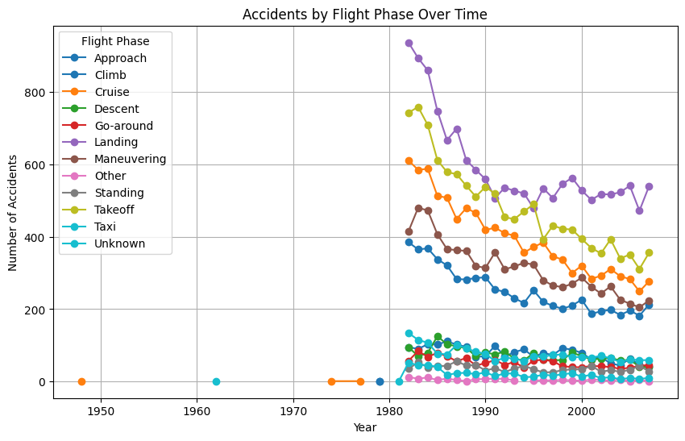
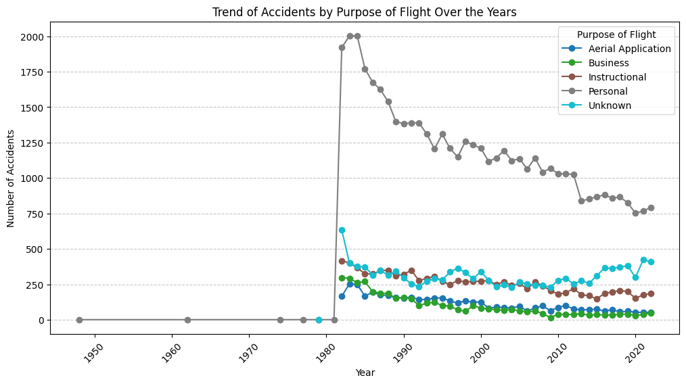

# AIRCRAFT ANALYSIS

### Overview

As the company expands into the aviation industry, understanding the risks associated with different aircraft models is crucial. This project analyzes historical aviation incident data to identify low-risk aircraft for commercial and private use.

### Objective
- Determine which aircraft models have the lowest accident rates.
- Identify key risk factors such weather, flight phase, aircraft manufacturer.
- Provide three concrete business recommendations to guide aircraft purchase decisions.

### Business Problem
As the company is expanding in to new industries to diversify its portfolio. Specifically, they are interested in purchasing and operating airplanes for commercial and private enterprises, but do not know anything about the potential risks of aircraft. You are charged with determining which aircraft are the lowest risk for the company to start this new business endeavor. You must then translate your findings into actionable insights that the head of the new aviation division can use to help decide which aircraft to purchase.

### Data
The data was sourced from [Aviation Accident Database & Synopses, up to 2023](https://www.kaggle.com/datasets/khsamaha/aviation-accident-database-synopses). The includes detailed information on aircraft such as  make, model, number of engines, weather conditions,flight purposes, different outcomes of flight accidents and the date the accident occurred.

Various data leaning techniques were applied to the data using **Pandas** to ensure the quality of data is improved and all missing values well handled.
### Data Visualization
Various visualizations were done to provide insights in to the data that would eventual lead to the correct business decision.
1. Analysis of accidents by make and model
Here, the analysis focuses on the aircraft make and models, fatality and survival rate of different makes and models.

2. Accidents by phase of flight.

   - From the analysis, we can conclude that most of the accidents occur during landing and take offs
3. Accidents by Flight purpose over time.

   - This visualization analyses the frequency of accidents across different flight purpose, highlighting that personal flight purpose have higher accident rates compared to others.

#### Conclusions  and Recomendations from the Aviation Risk Analysis
Based on the analysis of aviation accidents using AviationData.csv, the following key insights and business recommendations can be drawn:

1. Aircraft Make and Model Impact Accident Risk
   
    - Some aircraft makes and models have significantly higher fatalities compared to others such as CESSNA, which is also involved in the most accidents over time.
   - Make such us BOEING is involved in a number of fatal accidents, however the number of survivors is also on the highest end.

    ##### Recommendation:

   - The company should prioritize aircraft makes and models with lower accident rates when expanding in the the aviation industry and conduct thorough safety assessments before purchasing aircraft.

2. Engine Type and number of engines correlates with safety
   - Different engine types have varying fatality rates.
   - Certain engine types such as Reciprocating are associated with higher accident fatalities, while others have more uninjured passengers in incidents.

    ##### Recommendation:

   - The business should consider investing in aircraft with engine types that have lower fatality rates and higher survival rates in accidents. Most preference should be given to well-maintained engines with a strong safety record.

3. Flight Purpose Affects Risk Levels
    - The purpose of flight is also a key indicator of accident frequency.
    - Commercial and cargo flights tend to have higher accident occurrences, while certain private or military flights also show patterns of risk.

    ##### Recommendation:

   - The focus of the business should be on low-risk flight operations and strengthen pilot training, maintenance protocols, and operational safety measures for high-risk flight purposes.

[View Tableau Visualization](https://public.tableau.com/views/FlightAccidentAnalysis/FlightsFatalityAnalysis?:language=en-US&:sid=&:redirect=auth&:display_count=n&:origin=viz_share_link)

